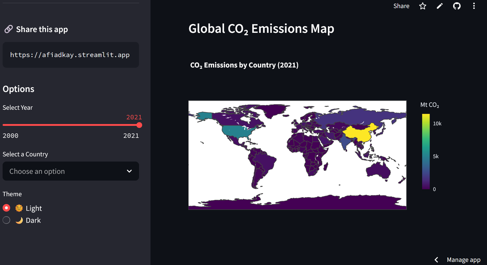

<h1 align="left">🌍 Global CO₂ Emissions, 2021</h1>

<p align="left">
  Track and visualize global carbon dioxide emissions by country and source from 2000–2021.
</p>

<p align="center">
  <a href="https://afiadkay.streamlit.app" target="_blank">
    View the Live App
  </a>
</p>

---

## 📊 About

This interactive Streamlit dashboard helps users explore CO₂ emissions globally using data from [Our World in Data](https://github.com/owid/co2-data). Features:

- 🌐 Choropleth map of CO₂ emissions per country
- 📈 Country-specific CO₂ trends over time
- 📊 Top 5 emitters stacked bar chart by source
- 🌗 Theme toggle (Light/Dark mode)

---

## 🌍 App Preview

<p align="center">
  
</p>

---

## 📦 Requirements

See requirements.txt — includes:
- [Streamlit](https://streamlit.io/)
- [Pandas](https://pandas.pydata.org/)
- [matplotlib](https://matplotlib.org/)
- [Plotly](https://plotly.com/)

---

## 💻 Run Locally

**Clone the repo:**

```bash
git clone https://github.com/afiadkay/co2-Emissions-by-Country.git
cd co2-Emissions-by-Country
pip install -r requirements.txt
streamlit run co2_dashboard.py
```

---

## 📤 Share this App

If you like the app, give it a ⭐ on GitHub and share the link!
<a href="https://afiadkay.streamlit.app" >🔗</a> 

---

## 🙌 Credits

- Data: [Our World in Data - CO₂ Dataset](https://github.com/owid/co2-data)
- Map: [Natural Earth GeoJSON](https://github.com/johan/world.geo.json)
